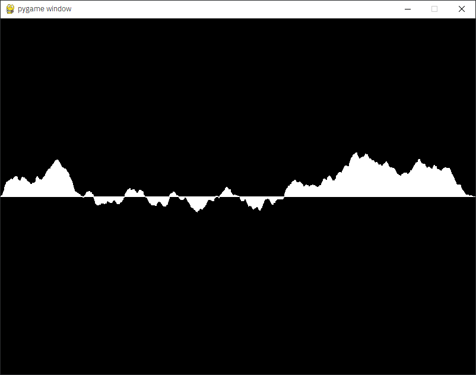

# terrain-generation

## discription

terrain generate program by python.

### Screenshots

https://user-images.githubusercontent.com/88187787/131543883-ffb783d0-b689-457e-ae1c-95e33d414289.mp4

## requirements
* python 3.7
* pygame 2.0.1
## how to use
First go to the repository directory and enter this `command`
     
    python main.py

Next, enter height and loop times

    height? 300
    loop_time? 10

* height is the max value of the height of mountains and trenches. 300 is recommended
* loop time is the loop time of the genelation. I think to know the meaning of this value, the best way is just try yourself or read source code. but the recommended value is 10.
